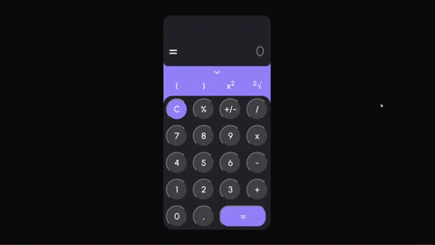

<h1 align="center"> ➗ JavaScript Calculator ➕</h1>
<p>This is a simple project made for study purposes, to training JS and improve HTML5 + CSS3 skills (using flex layout). It also uses SASS to improve maintance and scalability.</p>

  

### ✅ Features

- [x] All basics mathematical operations
- [x] Addition of Square Root and Power
- [x] Mathematical expressions (PENDAS)

## ❗ Prerequisite

Before you get started, it's necessary to have any browser of your preference, if you don't have anyone, I personally recommend:
- [Google Chrome](https://www.google.pt/intl/pt-PT/chrome/?brand=ISCS&gclid=CjwKCAjw7fuJBhBdEiwA2lLMYTPzdWRSSrt2n6EidIct2HRlhGrbPUgQqn4MQdunAMnmnLlhxBM3IBoCxrkQAvD_BwE&gclsrc=aw.ds)
- [Opera](https://www.opera.com/)

## ⌨ How To Use

### Download and run!

This project just needs to download and run in a browser, there's no additional step. 

```sh
  $ git clone https://github.com/Duarte64/JSCalculator.git
```

Don't worry, you won't will nedd any dependencies.



## 👷⚙ Tests

This project contemplantes only Front-End and doesn't use any server side tecnologies. I tried my best to do all case tests of usability, but if you find any bugs be welcome to fork this repository and improve it, or send me a message!

## 🛠 Tecnologies

The following tools where used in the development of this project:

- JavaScript
- HTML5
- CSS3
- [SASS](https://sass-lang.com)

## 💻 Autor

### Gabriel Duarte 🧑‍💻
### Made with ❤️
### 👋🏽 Get in touch!

[](https://www.linkedin.com/in/gabriel-duarte-da-paz-figueiredo-3aaa35197/) 
[](mailto:gabriel.duartepaz@gmail.com)
<br>
